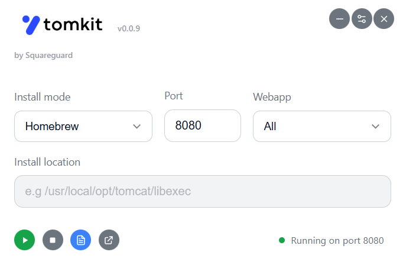

#  

[](https://opensource.org/licenses/ISC)
[](https://github.com/squareguard/TomKit)
[](https://www.electronjs.org/)

> A modern, lightweight desktop application for managing Apache Tomcat installations with real-time log monitoring and advanced search capabilities.

<div align="center">
  
</div>

## ✨ Features

- 🚀 **Easy Tomcat Management** - Start and stop Tomcat with a single click
- 📋 **Multiple Installation Types** - Support for Homebrew and manual installations
- 📊 **Real-time Log Monitoring** - Live tail of Tomcat catalina logs with color-coded log levels
- 🔍 **Advanced Search** - Find and highlight text in logs with navigation controls
- 📁 **Log Export** - Export logs to text files with timestamp
- 🗑️ **Log Management** - Clear log files directly from the interface
- 📏 **File Size Monitoring** - Real-time display of current log file size
- ⚙️ **Port Configuration** - Configure custom Tomcat ports
- 🌙 **Dark Theme** - Modern dark interface optimized for development
- 🖥️ **System Tray** - Minimize to system tray for background operation
- ⌨️ **Keyboard Shortcuts** - Quick actions with global hotkeys

## 🛠️ Installation

### Prerequisites
- Node.js (v16 or higher)
- npm or yarn
- Apache Tomcat (installed via Homebrew or manually)

### Download & Install

1. **Clone the repository:**
   ```bash
   git clone https://github.com/squareguard/TomKit.git
   cd TomKit/app
   ```

2. **Install dependencies:**
   ```bash
   npm install
   ```

3. **Run the application:**
   ```bash
   npm start
   ```

### Build from Source

Create distributable packages for your platform:

```bash
# macOS (creates .dmg)
npm run build:mac

# Windows (creates .exe installer)
npm run build:win

# Linux (creates .AppImage)
npm run build:linux

# All platforms
npm run build
```

## 🚀 Quick Start

### Configuration

1. **Launch TomKit** and select your installation type:
   - **Homebrew**: If Tomcat is installed via `brew install tomcat`
   - **Manual**: If you have a custom Tomcat installation

2. **Set Installation Path** (Manual only):
   - Browse to your Tomcat installation directory
   - Ensure `bin/startup.sh` and `bin/shutdown.sh` are present

3. **Configure Port** (Optional):
   - Set a custom port (default: 8080)
   - TomKit will automatically update `server.xml`

### Basic Operations

- **Start Tomcat**: Click the "Start/Play" button or use `Cmd/Ctrl + R`
- **Stop Tomcat**: Click the "Stop" button or use `Cmd/Ctrl + S`
- **View Logs**: Click "Log" button or use `Cmd/Ctrl + L`

## ⌨️ Keyboard Shortcuts

| Shortcut | Action |
|----------|--------|
| `Cmd/Ctrl + R` | Start Tomcat |
| `Cmd/Ctrl + S` | Stop Tomcat |
| `Cmd/Ctrl + L` | Toggle Log Window |
| `Cmd/Ctrl + Shift + T` | Show/Hide Main Window |
| `Enter` | Navigate to next search result |
| `Shift + Enter` | Navigate to previous search result |
| `Escape` | Clear search |

## 🛠️ Technical Details

### Built With
- **Electron** - Cross-platform desktop framework
- **Node.js** - Backend runtime
- **HTML/CSS/JavaScript** - Frontend interface
- **Native APIs** - System integration and file operations

### System Requirements
- **macOS**: 10.15 or later
- **Windows**: 10 or later
- **Linux**: Modern distributions with AppImage support

### File Locations
- **Configuration**: Stored in OS-specific user data directory
- **Logs**: Monitors standard Tomcat `logs/catalina.out`
- **Exports**: File name and location are chosen on export

## 🤝 Contributing

Contributions are welcome! Please feel free to submit a Pull Request. For major changes, please open an issue first to discuss what you would like to change.

### Development Setup

1. Fork the repository
2. Create your feature branch: `git checkout -b feature/amazing-feature`
3. Make your changes and test thoroughly
4. Commit your changes: `git commit -m 'Add amazing feature'`
5. Push to the branch: `git push origin feature/amazing-feature`
6. Open a Pull Request

## 📝 License

This project is licensed under the ISC License - see the [LICENSE](LICENSE) file for details.

## 🐛 Known Issues & Troubleshooting

### Common Issues

- **Tomcat won't start**: Ensure installation path is correct and scripts are executable
- **Log window empty**: Check that Tomcat is running and generating logs
- **Permission errors**: Run with appropriate permissions for Tomcat operations

### Platform-Specific Notes

- **macOS**: Homebrew installation path is automatically detected
- **Windows**: Manual installation requires full path to Tomcat directory
- **Linux**: Ensure execute permissions on Tomcat scripts

## 💡 Why TomKit?

> "I was getting tired of IntelliJ's inconsistent Tomcat integration constantly failing and having to recreate configurations after updates. TomKit was born from the need for a reliable, simple tool that just works - while also being a great opportunity to learn Electron development."

## 🔄 Version History

See [Releases](https://github.com/squareguard/TomKit/releases) for detailed changelog.

---

<div align="center">
  <strong>Made with ❤️ for Java developers who just want Tomcat to work</strong>
</div>
